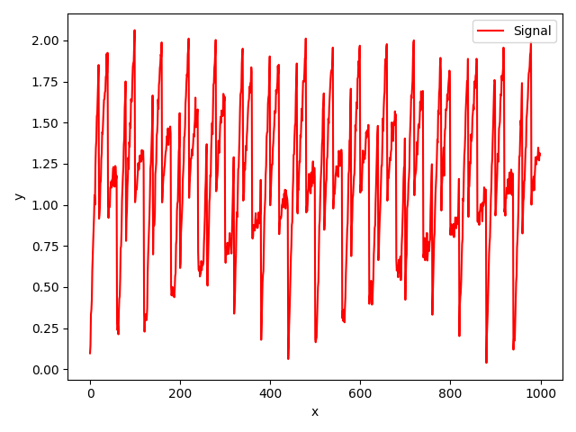
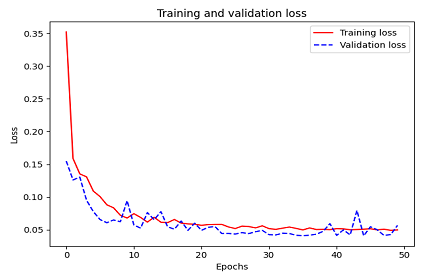
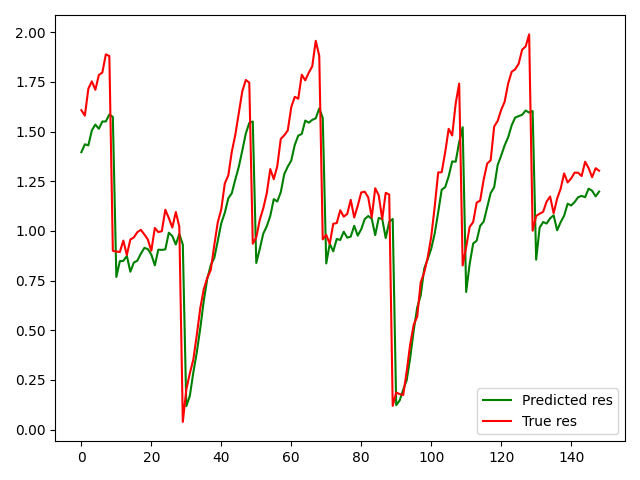
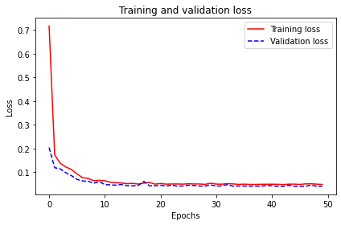
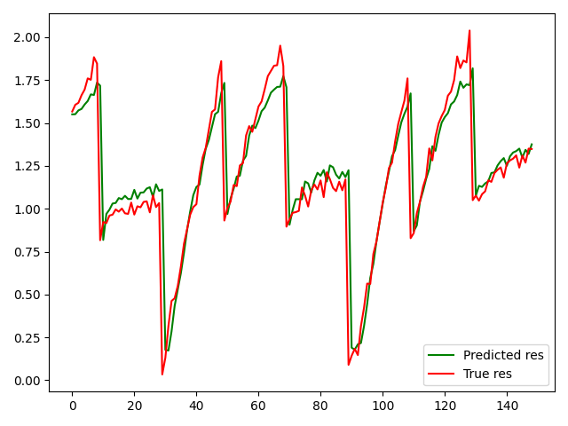

# Практика 7, вариант 8

## Задача

Необходимо построить рекуррентную нейронную сеть, которая будет прогнозировать значение некоторого периодического сигнала.

К каждому варианту предоставляется код, который генерирует последовательность. Для выполнения задания необходимо:

* Преобразовать последовательность в датасет, который можно подавать на вход нейронной сети
* Разбить датасет на обучающую, контрольную и тестовую выборку
* Построить и обучить модель
* Построить график последовательности, предсказанной на тестовой выборке

## Решение

### Преобразование в датасет

```py
def gen_data_from_sequence(seq_len = 1000, lookback = 10):
    seq = gen_sequence(seq_len)
    past = np.array([[[seq[j]] for j in range(i,i+lookback)] for i in range(len(seq) - lookback)])
    future = np.array([[seq[i]] for i in range(lookback,len(seq))])
    return (past, future, seq)
```



### Разделение на выборки

```py
dataset_size = len(data)
train_size = (dataset_size // 10) * 7
val_size = (dataset_size - train_size) // 2

train_data, train_res = data[:train_size], res[:train_size]
val_data, val_res = data[train_size:train_size+val_size], res[train_size:train_size+val_size]
test_data, test_res = data[train_size+val_size:], res[train_size+val_size:]
```

### Модель

Результаты исходной модели:



```py
Epoch 50/50
22/22 [==============================] - 3s 159ms/step - loss: 0.0448 - val_loss: 0.0566
```



#### Построение и обучение модели

```py
model = Sequential([
    GRU(60, recurrent_activation='sigmoid', return_sequences=True, recurrent_dropout=0.1),
    LSTM(40,  return_sequences=True,  recurrent_dropout=0.1),
    GRU(30, activation='relu', recurrent_dropout=0.1),
    Dense(1)
])

model.compile(optimizer='adam', loss='mse')
history = model.fit(train_data, train_res, epochs=50, validation_data=(val_data, val_res))
```

#### График предсказанной последовательности и потери модели



```py
Epoch 50/50
22/22 [==============================] - 2s 88ms/step - loss: 0.0387 - val_loss: 0.0412
```


