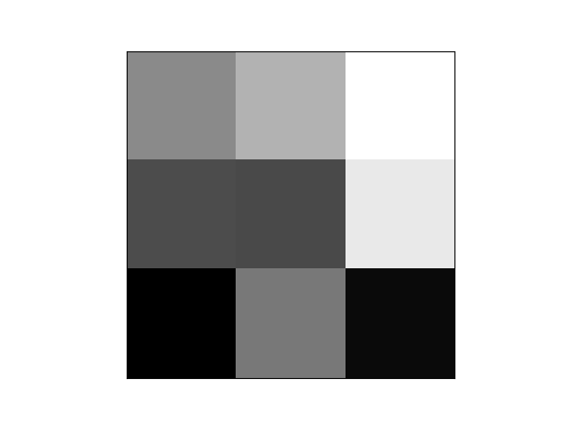
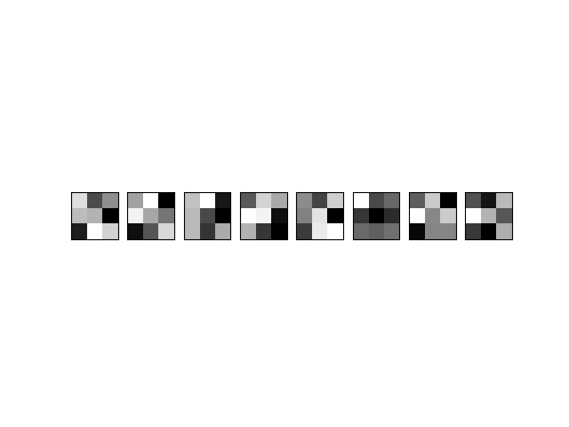
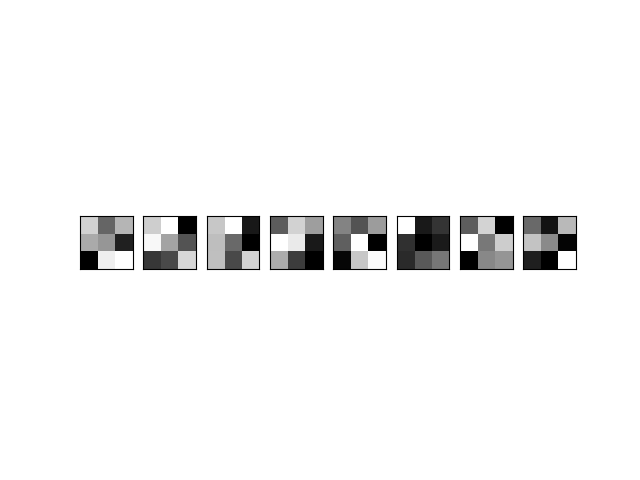
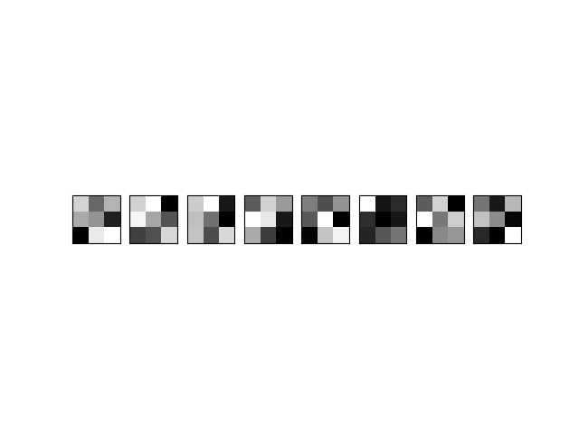

# Практика 8, вариант 2

## Задача

Необходимо реализовать собственный CallBack, и провести обучение модели из практического занятия №6 с написанным CallBack’ом.

`CallBack:`

Построение и сохранение карты признаков на заданных пользователем эпохах. Карта признаков - ядро свертки представленное в виде изображения. Название карты признака должно иметь вид <номер слоя>_<номер ядра в слое>_<номер эпохи>

### Решение

Был реализован собственный обратный вызов - `KernelsCallback`, наследуемый от класса `keras.callbacks.Callback`

```py
class KernelsCallback(Callback):
    def __init__(self, eps):
        self.eps = eps
        self.lays = [] 
                
    def set_model(self, model):    
        self.model = model  
        for i in range(len(model.layers)):
            if 'conv' in model.layers[i].name:
                self.lays.append(i)
        
    def on_epoch_end(self, epoch, logs=None):
        for layer in self.lays:        
            if epoch in self.eps:
                filters, biases = model.layers[layer].get_weights()
                
                f_min, f_max = filters.min(), filters.max()
                filters = (filters - f_min) / (f_max - f_min)
                
                out_channels = filters.shape[3]
                in_channels = filters.shape[2]
                
                for i in range(out_channels):
                    f = filters[:,:,:,i]    
                    ind = 1
                    for j in range(in_channels):
                        flt = plt.subplot(1, in_channels, ind)
                        flt.set_xticks([])
                        flt.set_yticks([])
                        plt.imshow(f[:,:,j], cmap='gray')
                        plt.savefig(f'imgs/{layer+1}_{i+1}_{epoch+1}.png')                    
                        ind += 1  
                    plt.clf()    
```

Инициализация:

```py
def __init__(self, eps):
    """ 
    eps : эпохи, на которых сохраняем карты признаков
    lays: номера сверточных слоев
    """
        self.eps = eps 
        self.lays = [] 
```

Модель и номера нужных слоев:

```py
def set_model(self, model):    
        self.model = model  
        """
        Если в названии слоя присутствует 'сonv':
        сохраняем его номер
        """
        for i in range(len(model.layers)):
            if 'conv' in model.layers[i].name:
                self.lays.append(i)
```

Метод, вызываемый в конце каждой эпохи, для сохранения всех карт признаков для каждого сверточного слоя:

```py
def on_epoch_end(self, epoch, logs=None):
        for layer in self.lays:        
            if epoch in self.eps:
                """Получаем карты признаков для текущего слоя"""
                filters, biases = model.layers[layer].get_weights()
                
                """
                Нормализуем значения весов до диапазона 0-1,
                чтобы облегчить их визуализацию
                """
                f_min, f_max = filters.min(), filters.max()
                filters = (filters - f_min) / (f_max - f_min)
                
                """Количество каналов"""
                out_channels = filters.shape[3]
                in_channels = filters.shape[2]
                
                """
                Представляем ядро свертки в виде изображения
                и сохраняем в папку imgs с названием <слой>_<фильтр>_<эпоха>
                """
                for i in range(out_channels):
                    f = filters[:,:,:,i]    
                    ind = 1
                    for j in range(in_channels):
                        flt = plt.subplot(1, in_channels, ind)
                        flt.set_xticks([])
                        flt.set_yticks([])
                        plt.imshow(f[:,:,j], cmap='gray')
                        plt.savefig(f'imgs/{layer+1}_{i+1}_{epoch+1}.png')                    
                        ind += 1  
                    plt.clf() 
```

### Пример

Темные квадраты обозначают малые веса, а светлые квадраты - большие веса

**Шестой фильтр первого сверточного слоя:**

1 эпоха             |  6 эпоха             |  10 эпоха
:-------------------------:|:-------------------------:|:-------------------------:
 |   |  

**Второй фильтр второго сверточного слоя:**

1 эпоха             |
:-------------------------:|
 |
6 эпоха             |
 |  
10 эпоха             |
 |
