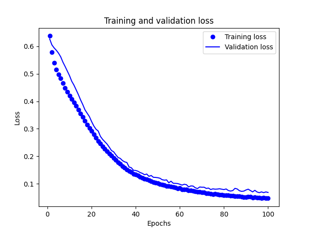
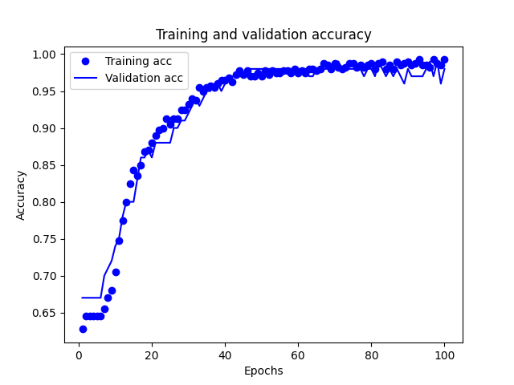
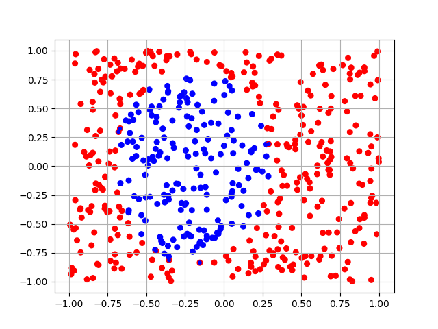

# Практика 2, вариант 3

## Задача

Необходимо дополнить следующий фрагмент кода моделью ИНС, которая способна провести бинарную классификацию по сгенерированным данным:

```python
import numpy as np
import matplotlib.pyplot as plt
import matplotlib.colors as mclr
from tensorflow.keras import layers
from tensorflow.keras import models
def genData(size=500):
    #Функцию выбрать в зависимости от варианта
def drawResults(data, label, prediction):
    p_label = np.array([round(x[0]) for x in prediction])
    plt.scatter(data[:, 0], data[:, 1], s=30, c=label[:, 0], cmap=mclr.ListedColormap(['red', 'blue']))
    plt.scatter(data[:, 0], data[:, 1], s=10, c=p_label, cmap=mclr.ListedColormap(['red', 'blue']))
    plt.grid()
    plt.show()
(train_data, train_label), (test_data, test_label) = genData()

#В данном месте необходимо создать модель и обучить ее

#Получение ошибки и точности в процессе обучения
loss = H.history['loss']
val_loss = H.history['val_loss']
acc = H.history['accuracy']
val_acc = H.history['val_accuracy']
epochs = range(1, len(loss) + 1)
#Построение графика ошибки
plt.plot(epochs, loss, 'bo', label='Training loss')
plt.plot(epochs, val_loss, 'b', label='Validation loss')
plt.title('Training and validation loss')
plt.xlabel('Epochs')
plt.ylabel('Loss')
plt.legend()
plt.show()
#Построение графика точности
plt.clf()
plt.plot(epochs, acc, 'bo', label='Training acc')
plt.plot(epochs, val_acc, 'b', label='Validation acc')
plt.title('Training and validation accuracy')
plt.xlabel('Epochs')
plt.ylabel('Accuracy')
plt.legend()
plt.show()
#Получение и вывод результатов на тестовом наборе
results = model.evaluate(test_data, test_label)
print(results)
#Вывод результатов бинарной классификации
all_data = np.vstack((train_data, test_data))
all_label = np.vstack((train_label, test_label))
pred = model.predict(all_data)
drawResults(all_data, all_label, pred)
```

## Решение

Для данной задачи была выбрана следующая архитектура:

* Входной слой c input_shape = 2
  
* Два скрытых слоя с 48 и 16 нейронами соответственно

  * На скрытых слоях будет использоваться фукнция активации relu
  
* Выходной слой с 1 нейроном

  * На выходном слое будет использоваться сигмоидная фукнция

```python
model = models.Sequential()
model.add(layers.Dense(48, activation='relu', input_shape=(2,)))
model.add(layers.Dense(16, activation='relu'))
model.add(layers.Dense(1, activation='sigmoid'))
```

В задаче в качестве оптимизатора будет использоваться RMSProp, функцией потерь
бинарная кросс-энтропия, а в качестве метрики используется точность

Обучение проводится в течение 100 эпох  пакетами по 20 образцов

```python
model.compile(optimizer='rmsprop', loss='binary_crossentropy', metrics=['accuracy'])
H = model.fit(train_data, train_label, 
              epochs=100, batch_size=20, 
              validation_data=(test_data, test_label), verbose=2)
```

## Графики





## Выводы

Сеть успешно обучается примерно за 70 эпох с высокой точностью и малой ошибкой

Для оценки модели после обучения на тестовых данных использовалась функция evaluate:

```python
model.evaluate(test_data, test_label)
# [0.06316622346639633, 0.9800000190734863]
```

В итоге получили, что для тестовых данных точность составляет 98%
