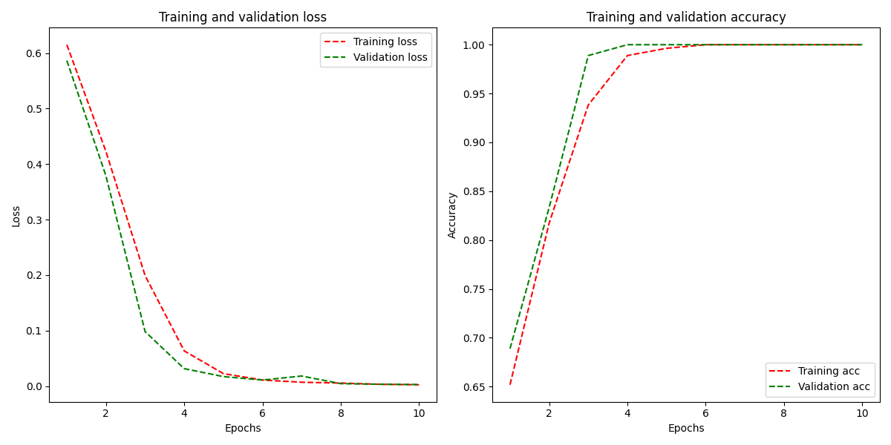

# Практика 6, вариант 1

## Задача

Необходимо построить сверточную нейронную сеть, которая будет классифицировать черно-белые изображения с простыми геометрическими фигурами на них.

Для генерации данных необходимо вызвать функцию gen_data, которая возвращает два тензора:

* Тензор с изображениями ранга 3
* Тензор с метками классов

Обратите внимание:

* Выборки не перемешаны, то есть наблюдения классов идут по порядку
* Классы характеризуются строковой меткой
* Выборка изначально не разбита на обучающую, контрольную и тестовую

### Подготовка данных

Прежде чем начать процесс обучения, нужно подготовить первоначально сгенерированные данные. Для этого была написана функция `data_preprocessing(X, y)`, которая кодирует метки, перемешивает и разбивает выборки

Для преобразования текста в числовые данные был использован класс `LabelEncoder` из `sklearn`

```py
encoder = LabelEncoder() 
y = encoder.fit_transform(Y.ravel())
# [['Square'],['Circle']] -> [[1],[0]]
```

Так как наблюдения классов идут по порядку, выборки были перемешаны

```py
idx = np.random.permutation(len(X))
X, y = X[idx], y[idx]
# y[:5]: [1 1 1 1 1] -> [0 0 1 1 0] 
```

Далее выборка была разбита на обучающую, контрольную и тестовую. Тестовая выборка занимает 10% всех данных, контрольная 10% от обучающих.

```py
val_split = 0.1
test_num = round((1-val_split)*len(X)) # индекс для тестовых
val_num = round(test_num*(1-val_split)) # индекс для валидационных
train_data, train_labels = X[:val_num], y[:val_num] # обучающие
val_data, val_labels = X[val_num:test_num], y[val_num:test_num] # контрольные
test_data, test_labels = X[test_num:], y[test_num:] # тестовые
train_data = np.expand_dims(train_data, axis=3) # доб. ось канала
val_data = np.expand_dims(val_data, axis=3)
test_data = np.expand_dims(test_data, axis=3)
```

### Модель

Модель состоит из двух сверточных слоев, двух субдискретизации, следующих за ними, двух полносвязных и одного прореживания.

```py
model = Sequential([
    Input(shape=(img_size, img_size, 1)),
    Conv2D(8, (3, 3), padding='same', activation='relu'),
    MaxPooling2D((2, 2)),
    Conv2D(16, (3, 3), padding='same', activation='relu'),
    MaxPooling2D((2, 2)),
    Flatten(),
    Dense(128, activation='relu'),
    Dropout(0.5),
    Dense(1, activation='sigmoid')
])
```

Параметры обучения:

```py
batch_size = 15
num_epochs = 10
model.compile(loss='binary_crossentropy',
              optimizer='adam',
              metrics=['accuracy'])
H = model.fit(train_data, train_labels,
              batch_size=batch_size, epochs=num_epochs,
              verbose=1, validation_data=(val_data, val_labels))
```

На графиках показаны потери и точность модели во время обучения



В конце была проведена оценка модели на тестовых данных

```py
model.evaluate(test_data, test_labels, verbose=1)
# 4/4 [==============================] - 0s 33ms/step - loss: 0.0062 - accuracy: 1.0000
```
